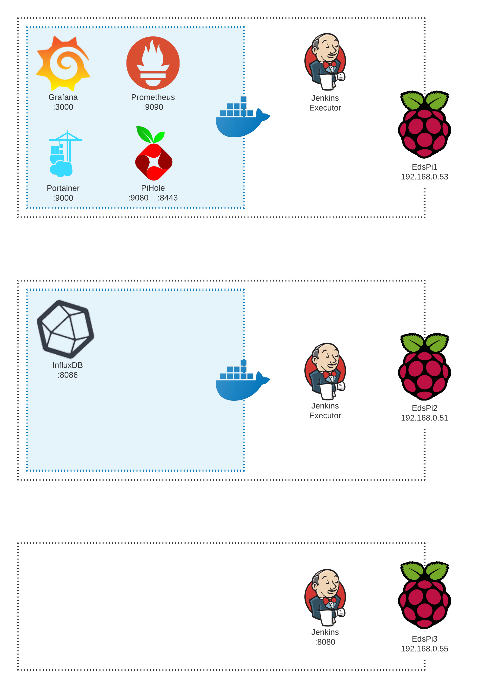

# Pi-Suite

Documentation of the architecture of Eds Pi Suite, with all code used to build applications.

## Monitoring

### Pi

General Pi statistics are gathered via [NodeExporter](https://github.com/prometheus/node_exporter) and sent to [Prometheus](https://prometheus.io/). Installation scripts in https://github.com/edklesel/Pi-Suite/tree/master/Monitoring/NodeExporter.

Details about top running processes are collected via Procmon. Installation scripts in https://github.com/edklesel/Pi-Suite/tree/master/Monitoring/ProcMon

### Docker

Docker monitoring is done via the Dockmon container. Details in https://github.com/edklesel/Pi-Suite/tree/master/Monitoring/DockMon

